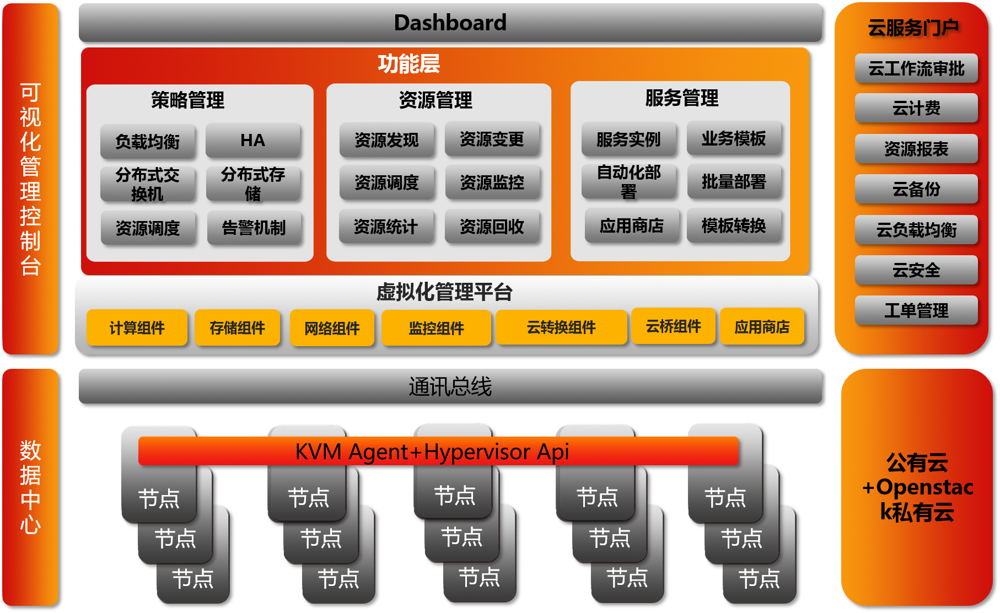

# OVM系统简介

   OVM从设计之初就决定要做一款完全符合国人使用习惯和特点的“新国货“Iaas产品。OVM产品架构的设计严格按照商业产品架构的高标准要求，把产品的稳定性、易用性、可扩展性，以及产品的高性能放在第一位，单单OVM架构的设计就花费了我们团队将近半年的时间，之所以我们如此重视OVM的架构设计，是因为我们觉得架构就是一个产品的灵魂所在，决定着产品日后的发展。OVM采用分布式、松耦合的模块化插件架构，分布式特点可以使管理平台规避单点故障，达到业务持续高可用，松耦合的模块化特点让产品在后期的扩展性方面不受任何限制，使其向下可以兼容数据中心所有硬件（通过OVM标准的Rest API接口），向上可以实现插件式的工作流引擎、计费引擎、报表引擎、桌面云引擎和自动化运维引擎。
   
   OVM产品目前由三大组件、七大模块组成。其中三大组件分别为OVM UI、OVM API和OVM数据中心组件，OVM UI提供WEB自服务界面，OVM API负责UI和数据中心组件之间的交互，OVM数据中心组件分别提供不同的功能。七大模块分别负责不同的功能实现，和三大组件之间分别交互。下图所示是OVM的总体架构图，体现了OVM三大组件与七大模块之间相辅相成的关系，由于每个模块各司其职，即使单个模块出现了故障也只是影响到该模块功能的使用，而不会影响平台整体使用。
 
   大家如果对比过会发现每个平台都会宣称自己的易用性、稳定性、可扩展性和高效，作为一款Iaas基础设施的软件，我们也不例外。但是具体到产品是否真正的做到了这四点，我想也只有用户最具有发言权，伟人毛主席说过“只有实践才是检验真理的唯一标准”，我们OVM产品发布之后，更想听听用户使用后的反馈，根据用户的反馈不断的优化产品，不断的促使产品向前发展。
下面我简单介绍下OVM在这四点上所做的努力，也欢迎各位看后为我们提供更多宝贵的建议。

**易用性**
  
  OVM的易用性首先体现在安装部署方面。传统的开源软件安装部署相信对于运维人员来说不会陌生，他们大多只会提供安装包和简单的安装文档，而这些安装过程大多会涉及到数据库、redis、rabbitmq、ruby等环境的配置，这些环境的配置也要求运维人员必须先去熟悉这些相关软件的安装部署，毕竟一步配置错误就会导致整体的安装部署失败，整个安装部署少则也需要2-3天时间才可搞定，多则需要1-2周，复杂的安装部署过程让运维人员疲惫不堪。
   
   OVM安装部署全部（包括管理平台和计算节点）采用一键式的ISO安装部署，整个安装过程就像是在安装一个Centos操作系统一样的简单，只用花费10-20分钟的过程就可以完成OVM的安装部署，极大的方便了运维人员，为他们省去了很多的宝贵时间。因为我们觉得真正易用的软件不会在安装部署上让运维人员为难，OVM要做的就是即使是一个刚进入运维行业的新人，通过OVM提供的iso镜像也可在1小时内完成整个产品的安装部署。
   
   OVM的易用性其次还体现在升级方面。对于一个产品来说，迭代升级是必然的事情，因为一个产品总是要向前发展的，OVM在设计之初就在考虑如何可以让用户不费吹灰之力就可以升级使用中的版本到最新版本。经过我们OVM团队多次的讨论，最终将升级与UI无缝结合，用户只用点击WEB管理平台中的一键升级按钮就可轻松实现版本的快速升级，整个升级过程用户几乎感知不到，丝毫不会影响到用户业务的运行。

**稳定性、可扩展性**
  
  OVM从架构设计之初就充分考虑到产品的稳定性，把产品的稳定放在第一位。因为作为一款Iaas虚拟化管理软件，其本身不仅仅是一个软件，而是连接用户数据中心的中枢（包括物理机、存储、网络、防火墙、灾备等）。在架构设计上，OVM分别参考了同行业开源软件、商业软件的产品架构，作为一款Iaas软件首先要保证产品无单点故障，即管理平台高可用；其次支持分布式部署，将不可预估因素造成的损失降到最小。因此OVM架构设计之一就是分布式、插件式，分布式和插件式的特点可以允许用户将不同的模块和服务，既可以部署在同一台Server上面，也可以将其分开部署在多台Server上，大大了提高了部署的灵活性，同时也可将单点故障的风险降到最小。另外OVM也引入了Zookeeper、Pacemaker等软件来为OVM提供高可用，避免单点故障的发生。此外，OVM的每个版本均经过严格的内测——OVM核心测试团队测试——市场公测——正式版发布，每一个环节我们都严把质量关，将稳定性自始至终贯穿到OVM的每个环节。
   
   分布式和插件式的特点也为OVM的扩展提供了无限大的可能。模块化的插件式架构允许用户根据自己的需求来定制自己所需的模块，毕竟不同行业的用户还是存在不少差异的，即使是相同行业不同企业的用户也是会有所差距的，此时每个用户都可能会有自己的不同需求，获益于OVM插件式的架构，用户只需要根据自己的需求增加不同的模块来实现自己所需的功能就可以，可谓是真正的无限扩展，另外OVM完善的API可以助力用户、商业软件生产商集成第三方软件到OVM平台。比如IDC运营商想要的是一个公有云门户对外提供有偿服务，那么就可以根据自己的需要增加一个公有云模块到OVM平台，一般企业用户想要的是一个私有云，那么可以直接使用OVM轻松构建自己的私有云平台，而政府、事业单位、以及大规模企业则想要的是一个混合云环境，因为这类单位既有自己内部的高保密业务，也有对外提供服务的公有云业务，那么此类单位则可以使用OVM的API借口对接阿里云、腾讯云、亚马逊云、Openstack等，实现自己的混合办公需求。

**高效**

    高效是检验一个平台设计是否优秀的关键。大家都希望管理平台能为自己的工作带来高效率，这也是选择使用一个平台的初衷，OVM设计之初就将平台的高效性视为关键，整体采用全异步、无等待、无锁架构来确保平台的每个任务都是独立执行，即使同时有存储任务、网络任务、虚拟机任务等都在执行也互不干扰，从此避免了多任务同时执行带来的阻塞问题。另外OVM全异步架构也可以为一些批量任务的执行带来高效率，比如虚拟机的批量创建、监控数据的采集、节点状态的检测等，这些任务都可以为用户节省大量的时间，全异步架构说简单点就是各干各的事情，极大的提高了完成工作的效率。OVM无锁、无等待架构既保证了高并发，也兼顾了整体的性能。
